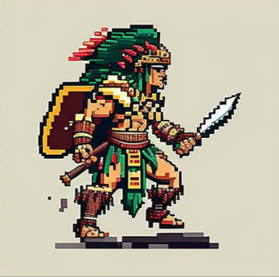
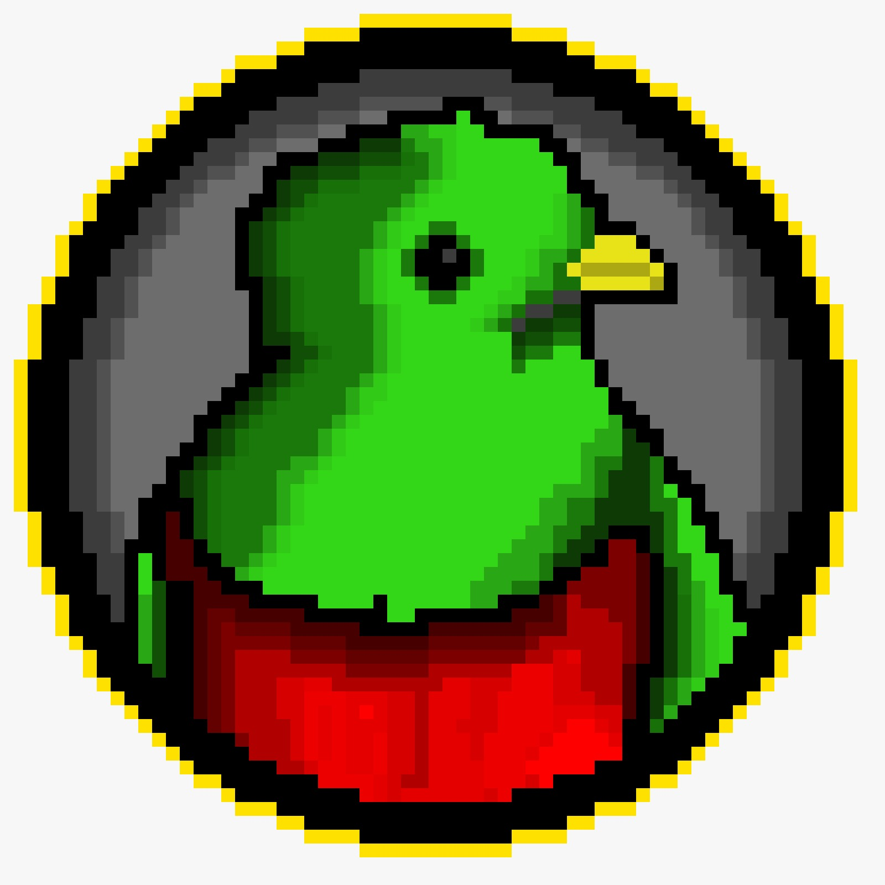
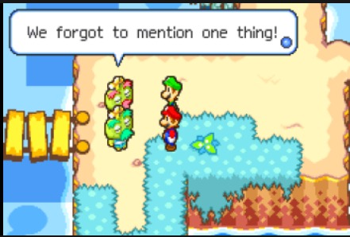
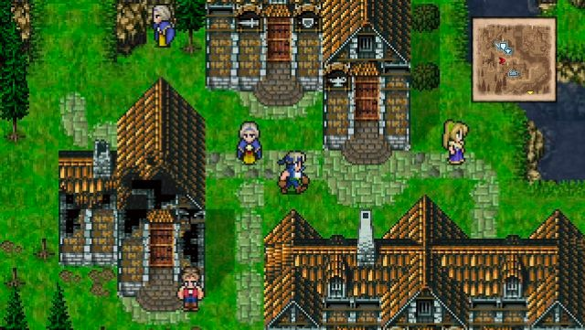
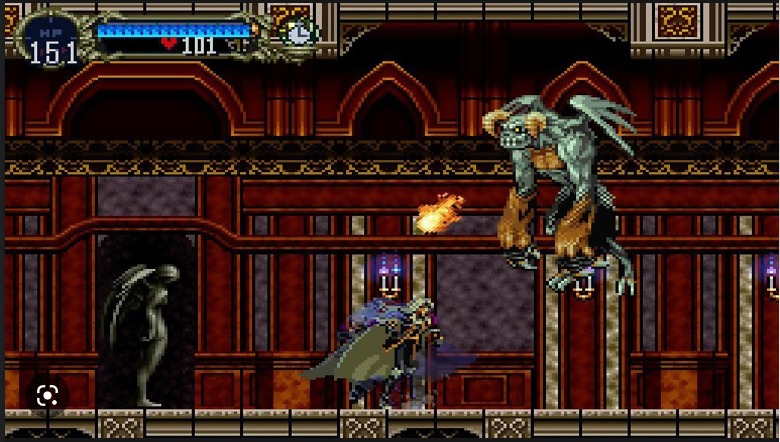
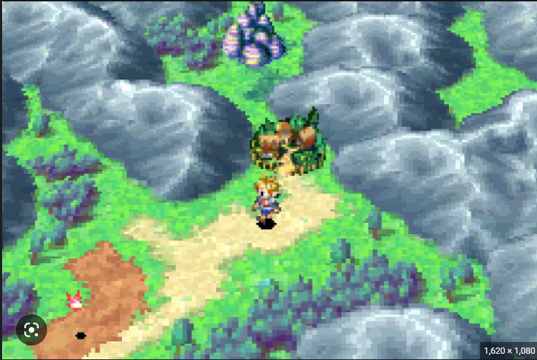

# **Quetzal**

## _Game Design Document_

---

##### **Copyright notice / author information / boring legal stuff nobody likes**

## Colaborators: Team "LEGENDS"

#### Gabriel Rodríguez De Los Reyes

#### Iker García Germán

#### Rodrigo Núñez Magallanes

#### Enrique Cabrera Aguilar

#### Alejandro Arouesty Galván

#### Pablo Banzo Prida

## Instructors:

#### Esteban Castillo Juarez

#### Gilberto Echeverría Furió

#### Octavio Navarro Hinojosa

## _Index_

---

<!--
1. [Index](#index)
2. [Game Design](#game-design)

   1. [Summary](#summary)
   2. [Idea Pitch](#idea-pitch)
   3. [Game Genre](#game-genre)
   4. [Gameplay](#gameplay)
   5. [Mindset](#mindset)
   6. [RPG Elements](#rpg-elements)
   7. [Game Mechanics and Rules](#game-mechanics-and-rules)
   8. [Stats](#stats)

3. [Technical](#technical)
   1. [Screens](#screens)
   2. [Controls](#controls)
   3. [Mechanics](#mechanics)
4. [Level Design](#level-design)
   1. [Themes](#themes)
      1. Ambience
      2. Objects
         1. Ambient
         2. Interactive
      3. Challenges
   2. [Game Flow](#game-flow)
5. [Development](#development)
   1. [Abstract Classes](#abstract-classes--components)
   2. [Derived Classes](#derived-classes--component-compositions)
6. [Graphics](#graphics)
   1. [Illustrations](#illustrations)
   2. [Visual References](#visual-references)
   3. [Style Attributes](#style-attributes)
   4. [Graphics Needed](#graphics-needed)
7. [Sounds/Music](#soundsmusic)
   1. [Style Attributes](#style-attributes-1)
   2. [Sounds Needed](#sounds-needed)
   3. [Music Needed](#music-needed)
8. [Schedule](#schedule) -->

## _Game Design_

---

### **Summary**

A Mayan general's son must use his wits, strength, and the power of the gods to defeat the Spanish invaders and protect his people.

Navigate treacherous dungeons to find the Mayan god who will grant you the power to defeat the invaders and prove yourself worthy of their power.

 

### **Idea Pitch**

In this game, you play as the son of one of the most important Mayan generals of the time. Trained to be a skilled warrior, you now face the threat of Spanish conquistadors who want to take everything from you: your resources, your friends, your family, and even your religion. Despite the fact that the Spanish have superior weaponry, he seeks the help of the gods to gain an advantage in battle. When your brother is murdered by a Spanish conquistador, you must channel your anger and frustration into defeating the invaders and protecting your people.

You must travel through treacherous dungeons to find the Mayan god who will grant you the power to defeat the invaders. These dungeons are full of traps, puzzles, and enemies that will test your skills as a warrior. You will need to use your wits and strength to overcome these challenges and prove yourself worthy of the god's power.

Along the way, you will face setbacks and obstacles, but you must persevere and continue to overcome yourself in order to avenge your brother's death. You will meet other characters that can either help you or hinder your progress, and you must choose your allies wisely.

As you progress through the game, you'll unlock new abilities and upgrades that will make you stronger and better equipped to take on the Spanish conquistadors. With each victory, you will get closer to your ultimate goal of defeating the enemy and saving your people.

Can you harness the power of the gods and become the hero of this story?

 

### **Game Genre**

Genre: Fantasy RPG Rouge-like Game.

This game combines the elements of a fantasy role-playing game with the challenge of a rogue-like game, allowing players to explore a variety of dungeons and battle against dangerous enemies.

The player will have the chance to choose powerful weapons and gear, use clever tactics to defeat enemies, and discover the amazing world.

This game combines the elements of a fantasy role-playing game with the challenge of a rogue-like game, allowing players to explore a variety of dungeons and battle against dangerous enemies. The player will have the chance to choose powerful weapons and gear, use clever tactics to defeat enemies, and discover the amazing world

 

### **Gameplay**

In order to develop a fluent game we decided to construct a scenario in which our main character needs to explore new places in order to fulfill its mission. To do so, we would create a spawning (main) world, where PvP is not active in which you can explore and get to know the story in more depth trough NPC interactions. In this first area, the camera would be placed in a top-down perspective that allows the character to explore in any direction. Once in this world, the player is going to be able to find a dungeon, where the real PvP starts. Inside the dungeon the perspective will also be top down, but the design elements will help the payer understand he entered a completely different space. This dungeon would force you to keep exploring through it by not allowing you to exit unless you die (or win).

This system works in such a way that the more time you spend inside the dungeon, the difficulty increases but the chance of getting more items to improve your player also increase.

This dungeon would be randomly generated to motivate players to play it again, and see what has changed. Inside the dungeon there will be items that boost certain stats in a specific way, like a sword that increases the damage a character induces.

At this moment, when you leave the dungeon, the game will tell you that you are ready to go and fight the final boss. This boss will be a very strong enemy that will require a lot of skill to defeat. Once you defeat the boss, you will be able to go back to the main world and explore it; as well as going back to the dungeon to try to find new and better items. If you die against the boss, you will lose your power and need to go back to the dungeons to get it back. This way the player will think twice before ending the final battle, and encourage him to keep exploring the world.

 

### **Mindset**

We want the player to feel adventurous, and we also want him to feel pride in the cultures that once lived in the lands that we live now. We want him to wonder about what these cultures were, how they used to live and fight and how the coming of the Spanish people affected forever the fate of our lands. We intend to create these emotions by recreating the scenery and the looks of the native people through our NPCs, and we wish to illustrate the replacement of the religion by introducing a lot of the older religions' visuals, gods and other suchelements.

 

### **RPG Elements**

 

The RPG elements that will be used in this game are the following:

**Story**: Just as said in the elevator pitch. You are the son of a powerfull mayan general. Spanish conquest is just begging, and you aid for the gods of your religion to destroy your enemies.

**Setting**: Mexico, Mayan Riviera in the 1500s.

**Exploration**: You start by the village of where you were born, and move through the place to find resources. Most importantly you found the entrance for a dungeon where you suppose the mayan gods are waiting for the chosen one.

**Quests**: The main quest is to defeat the main boss. But you will find yourself with multiple side quests for leveling up your chararacter. Such quests have to do with going in the dungeons to recieve items to defeat the boss.

Since this game is a RPG, we will be using items to give the player a sense of progression. These items will be used to increase the player's stats, and will be used to fight against enemies.

**Tools**:

- Pickaxe: Used to mine resources.
- Axe: Used to cut trees.

**Weapons**:

- Knife: Used to fight enemies in short range.
- Spear: Used to fight enemies in medium range.
- Bow: Used to fight enemies from a distance.

**Interface**

- _Health bar_: Shows the amount of health the player has.
- _Time_: Shows the time inside the game (or inside the dungeon).
- _Map_: Shows the map of the world.

**Graphics**

| **Overworld** | **Dungeon** | **Boss Fight** |
| :-----------: | :---------: | :------------: |
|    - Trees    |   - Mobs    |     - Boss     |
|    - Rocks    |   - Items   |    - Effects    |
|    - House    |             |                |

### **Game Mechanics and Rules**

<!-- General Info -->

#### **General Info**

The game will be 2D, with a top-down perspective in the main world, dungeons and boss fight. The game will alow you to explore in the main world and fight in the dungeons.

The game will be rogue-like, meaning that the dungeons will be randomly generated, and the player will have to fight against enemies and bosses to get better items and get a sense of achievement.

At the beginning of the game, the player will be able to choose between 3 different classes, each with different stats and abilities. This will allow the player to choose the class that best suits his playstyle. The classes are:

- Warrior: starts with knife

  - high health (500 HP)
  - mid agility (50 AGI)
  - low attack (25 ATK)

    | HP  | ATK | AGI |
    | :-- | :-: | :-: |
    | 500 | 50  | 25  |

- Archer: starts with bow

  - high agility (75 AGI)
  - low health (150 HP)
  - mid attack (50 ATK)

    | HP  | ATK | AGI |
    | :-- | :-: | :-: |
    | 150 | 50  | 75  |

- Hunter: starts with spear

  - mid health (250 HP)
  - low agility (25 AGI)
  - high attack (75 ATK)

    | HP  | ATK | AGI |
    | :-- | :-: | :-: |
    | 250 | 75  | 25  |

Note:

- All classes start with an axe and a pickaxe.
- Since classes will be stored on a database, initial stats can be changed easily and will be balanced after more testing.

Each item has a specific effect on the following player's stats

### **Stats**

There's three stats that are affected by the class the player chooses at the beginning of the game (and which can be increased or decreased by finding items in the dungeon):

- Health (HP): The amount of damage a character can take before dying. Range: 0-1000.
- Attack (ATK): The amount of damage a character can do per hit to an enemy. Range: 0-100.
- Agility (AGI): How fast can the character move and dodge. Range: 0-100.

The following two stats start at 0 and can only be increased by finding items in the dungeon:

- Mana Points (MP): The amount of damage the character deals with a special attack. Range: 0-100.
- Defense (DEF): The amount of damage a character can take per hit from an enemy. It's a divider of the attack stat. Range: 0-100.

### **Items**

The odds of finding an item in the dungeon will be based on the dungeon level (which is related to the time the player spends inside the dungeon). The higher the dungeon level, the higher the chance of finding a rare or godly item.

<!-- Class upgrades -->

#### **Class upgrades:**

- Knives:

  - Iron Knife: +10 ATK (common)
  - Steel Knife: +20 ATK (rare)
  - Diamond Knife: +30 ATK (godly)

- Spears:

  - Iron Spear: +10 ATK (common)
  - Steel Spear: +20 ATK (rare)
  - Diamond Spear: +30 ATK (godly)

- Bows:
  - Iron Bow: +10 ATK (common)
  - Steel Bow: +20 ATK (rare)
  - Diamond Bow: +30 ATK (godly)

#### **HP Recovery:**

- Health Potion: +50 HP (common)

#### **Armor:**

- Leather Armor (Light) (common)

  - +20 AGI
  - -10 DEF

- Iron Armor (Medium) (rare)

  - -10 AGI
  - +15 DEF

- Diamond Armor (Heavy) (godly)
  - -20 AGI
  - +25 DEF

#### **HP upgrades:**

- Blue Ring: +100 HP (common)
- Red Ring: +200 HP (rare)
- Green Ring: +300 HP (godly)

#### **Enemies**

The enemies will have different stats and abilities. The enemies only exist in the dungeon, and their stats will be multiplied by the dungeon level (which will increase along with the time the player spends inside the dungeon).

- Musketeer (Ranged): Has a musket that shoots three bullets at a time. The bullets will travel in a straight line until it hits an enemy or a wall.

  | HP  |       ATK       | AGI |
  | :-- | :-------------: | :-: |
  | 80  | 30 (per bullet) | 25  |

- Captain (Ranged): Has a gun that shoots one bullet at a time. The bullet will travel in a straight line until it hits an enemy or a wall.

  | HP  | ATK | AGI |
  | :-- | :-: | :-: |
  | 125 | 40  | 50  |

- Dog (Melee): The dog will chase the player until it reaches him, and will attack him if it gets close enough.

  | HP  | ATK | AGI |
  | :-- | :-: | :-: |
  | 50  | 25  | 75  |

<!-- Boss -->

- Boss: The boss will have a lot of health, and will have a special attack that will deal a lot of damage to the player. The boss will also have a special ability that will allow him to teleport to a random location in the dungeon.

  | HP  | ATK | AGI |
  | :-- | :-: | :-: |
  | 750 | 100 | 75  |

Note: the boss's stats won't be affected by the time spent in the dungeon.

## _Technical_

---

### **Screens**

The basic screens of the game are the following:
1. Login Screen: There will be a main input area where you can either register (a dropdown menu) or log in with a complementing login button.

2. Title Screen: as a central focus point it has a large start button and the title of the game on top. As for scondary items on the right side there will be smaller buttons that enlagre when hovered; they will include the an "about", several ones related to relevant social medias, and a bug reporting button. On the upper right corner there will be a greeting for the player as well as the username.

3. Game
   1. Overworld: has a map, a health bar, a time bar, and a button to go to the dungeon once the player has found the entrance.
   
   2. Dungeon: has a map, a health bar, a time bar, and a button to go back to the overworld once the player has finished the dungeon.
   3. Boss Fight: has a health bar, a time bar, and a button to go back to the overworld once the player has defeated the boss.
   
4. End Screen: has a restart button, a credits button.
   

### **Controls**

The controls for the game are keyboard only. The player will be able to move around the world with the arrow keys, and interact with the environment with the space bar and/or enter key. In addition to the arrow keys, the player will be able to use the WASD keys to move around the world.

Regarding menus, the player will be able to navigate through them with the arrow keys, and select an option with the space bar and/or enter key. Mouse support might be added later on.

### **Listado de clases a programar**

1. Player Classes
   - **PlayerHealth**:Reduces player health in case of recieving damage
   - **PlayerShooting**: Controls player shooting with mouse
   - **PlayerMovement**: Controls player movement with w,a,s,d keys
   - **PlayerStats**: Compiles and stores all player stats
   - **PlayerMeleeAttack**: Controls player melee attack with mouse
2. Enemy Classes
   - **EnemyHealth**: Reduces enemy health in case of recieving damage
   - **EnemyMovement**: Controls enemy movement according to player's position
   - **EnemyShooting**: Controls enemy shooting style
   - **EnemyStats**: Compiles and stores all enemy stats
3. Dungeon and Boss fight Classes
   - **GameTracker**: Tracks the game's progress, such as number enemies alive, or state of the game
   - **MapGenerator**: Generates the map of the dungeon
   - **LevelGenerator**: Generates the enemies and items of the dungeon
   - **DoorsManager**: Incharge of openinng or clossing sections of the dungoen to control the flow of the game
   - **LevelManager**: Incharge of loading the next levels of the dungeon
4. Item Classes
   - **ItemStats**: Stores all item stats and modifies player stats accordingly
5. Audio Classes
   - **MusicManager**: Controls the music of the game in each scene
6. OverWorld Classes
   - **OverWorldManager**: Controls the flow of the overworld
   - **OverWorldUI**: Incharge of the triggers of the overworld
   - **DungeonEntrance**: Initiates the dungeon

### **Listado de assets**

1. Character sprites:
   - Hunter sprite sequence
   - Warrior sprite sequence
   - Archer sprite sequence
2. Tools sprites:
   - Pickaxe sprite
   - Axe sprite
3. Weapons sprites:
   - Knife sprite
   - Spear sprite
   - Bow sprite
4. Enemies:
   - Musketeer sprite sequence
   - Captain sprite sequence
   - Dog sprite sequence
   - Boss sprite sequence
5. Enviroment sprites:
   - Rocks 
   - Huts / Houses 
   - Main Plateau 
   - Dungeons
   - Boss fight 
   - Trees
   - Chest opening/closing
   - Fire
   - Doors
6. Sound
   - Walking on grass
   - Walking on the dungeon
   - Punching tree
   - Rock
   - NPC's sounds
   - Fighting sounds (shooting, taking damage, etc)
   - Plateau / Dungeon / Boss fight music
   - Door
   - Fire
   - Chest 
   

   
 

## _Level Design_

---

### **Game Flow**

1. The player starts in the overworld, and has to find the entrance to the dungeon.
2. The player talks to the NPC, and gets a quest.
3. The player gets context about the quest by exploring the overworld.
4. The player finds keys to open the door to the dungeon.
5. The player enters the dungeon and can't exit until he has defeated all the enemies. The player can stay in the dungeon as long as he wants, but the complexity of the dungeon will increase as time passes.
6. If the player defeats all the enemies, he can exit the dungeon and go back to the overworld.
7. If the player dies, he has to restart.
8. The player can accept a challenge from the boss, and enter the boss fight.
9. If the player defeats the boss, he wins the game.

10. Player starts in forest
11. Pond to the left, must move right
12. To the right is a hill, player jumps to traverse it (&quot;jump&quot; taught)
13. Player encounters castle - door&#39;s shut and locked
14. There&#39;s a window within jump height, and a rock on the ground
15. Player picks up rock and throws at glass (&quot;throw&quot; taught)
16. … etc.

_(example)_

## _Development_

---

<!-- ### **Abstract Classes / Components**

1. BasePhysics
   1. BasePlayer
   2. BaseEnemy
   3. BaseObject
2. BaseObstacle
3. BaseInteractable

_(example)_ -->

<!-- ### **Derived Classes / Component Compositions**

1. BasePlayer
   1. PlayerMain
   2. PlayerUnlockable
2. BaseEnemy
   1. EnemyWolf
   2. EnemyGoblin
   3. EnemyGuard (may drop key)
   4. EnemyGiantRat
   5. EnemyPrisoner
3. BaseObject
   1. ObjectRock (pick-up-able, throwable)
   2. ObjectChest (pick-up-able, throwable, spits gold coins with key)
   3. ObjectGoldCoin (cha-ching!)
   4. ObjectKey (pick-up-able, throwable)
4. BaseObstacle
   1. ObstacleWindow (destroyed with rock)
   2. ObstacleWall
   3. ObstacleGate (watches to see if certain buttons are pressed)
5. BaseInteractable
   1. InteractableButton

_(example)_ -->

## _Graphics_

---

### **Illustrations** !

Main character:

Game logo:

Main scenery sketch:

 

### **Visual References** !

Mario and Luigi Superstar Saga:

Final Fantasy 6:

Castlevania:

Golden sun:

 

### **Style Attributes**

What kinds of colors will you be using? Do you have a limited palette to work with? A post-processed HSV map/image? Consistency is key for immersion.

What kind of graphic style are you going for? Cartoony? Pixel-y? Cute? How, specifically? Solid, thick outlines with flat hues? Non-black outlines with limited tints/shades? Emphasize smooth curvatures over sharp angles? Describe a set of general rules depicting your style here.

Well-designed feedback, both good (e.g. leveling up) and bad (e.g. being hit), are great for teaching the player how to play through trial and error, instead of scripting a lengthy tutorial. What kind of visual feedback are you going to use to let the player know they&#39;re interacting with something? That they \*can\* interact with something?

### **Graphics Needed**

1. Characters
   1. Human-like
      1. Goblin (idle, walking, throwing)
      2. Guard (idle, walking, stabbing)
      3. Prisoner (walking, running)
   2. Other
      1. Wolf (idle, walking, running)
      2. Giant Rat (idle, scurrying)
2. Blocks
   1. Dirt
   2. Dirt/Grass
   3. Stone Block
   4. Stone Bricks
   5. Tiled Floor
   6. Weathered Stone Block
   7. Weathered Stone Bricks
3. Ambient
   1. Tall Grass
   2. Rodent (idle, scurrying)
   3. Torch
   4. Armored Suit
   5. Chains (matching Weathered Stone Bricks)
   6. Blood stains (matching Weathered Stone Bricks)
4. Other
   1. Chest
   2. Door (matching Stone Bricks)
   3. Gate
   4. Button (matching Weathered Stone Bricks)

_(example)_

## _Sounds/Music_

---

### **Style Attributes**

Again, consistency is key. Define that consistency here. What kind of instruments do you want to use in your music? Any particular tempo, key? Influences, genre? Mood?

Stylistically, what kind of sound effects are you looking for? Do you want to exaggerate actions with lengthy, cartoony sounds (e.g. mario&#39;s jump), or use just enough to let the player know something happened (e.g. mega man&#39;s landing)? Going for realism? You can use the music style as a bit of a reference too.

Remember, auditory feedback should stand out from the music and other sound effects so the player hears it well. Volume, panning, and frequency/pitch are all important aspects to consider in both music _and_ sounds - so plan accordingly!

### **Sounds Needed**

1. Effects
   1. Soft Footsteps (dirt floor)
   2. Sharper Footsteps (stone floor)
   3. Soft Landing (low vertical velocity)
   4. Hard Landing (high vertical velocity)
   5. Glass Breaking
   6. Chest Opening
   7. Door Opening
2. Feedback
   1. Relieved &quot;Ahhhh!&quot; (health)
   2. Shocked &quot;Ooomph!&quot; (attacked)
   3. Happy chime (extra life)
   4. Sad chime (died)

_(example)_

### **Music Needed**

1. Slow-paced, nerve-racking &quot;forest&quot; track
2. Exciting &quot;castleb&quot; track
3. Creepy, slow &quot;dungeon&quot; track
4. Happy ending credits track
5. Rick Astley&#39;s hit #1 single &quot;Never Gonna Give You Up&quot;

_(example)_

## _Schedule_

---

_(define the main activities and the expected dates when they should be finished. This is only a reference, and can change as the project is developed)_

1. develop base classes
   1. base entity
      1. base player
      2. base enemy
      3. base block
2. base app state
   1. game world
   2. menu world
3. develop player and basic block classes
   1. physics / collisions
4. find some smooth controls/physics
5. develop other derived classes
   1. blocks
      1. moving
      2. falling
      3. breaking
      4. cloud
   2. enemies
      1. soldier
      2. rat
      3. etc.
6. design levels
   1. introduce motion/jumping
   2. introduce throwing
   3. mind the pacing, let the player play between lessons
7. design sounds
8. design music

_(example)_
